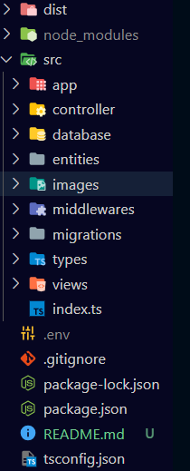

## - Repositorio del proyecto: https://github.com/Gaston-Valentini/proyect4-ink-world
## - Título: INK WORLD
## - Desarrollador: Gastón Valentini
## - Descripción: Proyecto realizado en GeeksHubs Academy, se trata del desarrollo de un servidor y una base de datos para el manejo de citas de un estudio de tatuajes.
## - Objetivo: Demostrar y poner en práctica los conocimientos adquiridos en desarrollo backend en GeeksHubs Academy.
## Tecnologías utilizadas:
#### * Node.js y Express (Desarrollo del servidor y manejo de enpoints)
#### * Typescript (Lenguaje de programación utilizado)
#### * TyperORM (Conexión a la base de datos e interacción con las entidades)
#### * MySQ (Base de datos utilizada)
#### * Postman (Testeo de rutas)
## - Estructura del proyecto (Modelo Vista Controlador): Además de este README.md, el proyecto consta de la siguiente estructura:
#### * index.ts (Es el archivo que arranca la aplicación, inicia el servidor y se conecta a la base de datos)
#### * app (Servidor)
#### * controllers
#### * database
#### * entities
#### * middlewares
#### * migrations
#### * types
#### * viewes

## Sripts:
#### * "start" (Iniciar el prouecto en modo de producción)
#### * "dev" (Iniciar el proyecto en modo de desarrollo)
#### * "build" (Compilación de la aplicación de TypeScript a JavaScript)
## Enpoints:
● Registro de usuarios.
● Login de usuarios.
● Perfil de usuario.
● Modificación de datos del perfil

● Creación de citas.
● Editar citas.
● Eliminación de citas

● Ver todas las citas que tengo como cliente (solo las propias).
● Ver todas las citas existentes conmigo (role tatuador).
● Listar tatuadores

● Ver todos los clientes registrados (super admin)
● Crear tatuadores (superadmin)
● Ver todos los clientes registrados (super admin)
● Eliminar usuario del sistema(super admin )
● Ver una cita en detalle
● El super_admin debe otorgar roles a los usuarios del sistema
● Validar la fecha de la cita
● Añadir tipos de intervención (tattoo / piercing ) a las citas